

<!-- _class: invert lead -->

# Evidence is all you need

### David Yallup (<dy297@cam.ac.uk>)
<!-- &nbsp;
&nbsp; -->
 _Cavendish HEP seminars_
 1st November 2022

 

----

### Backstory

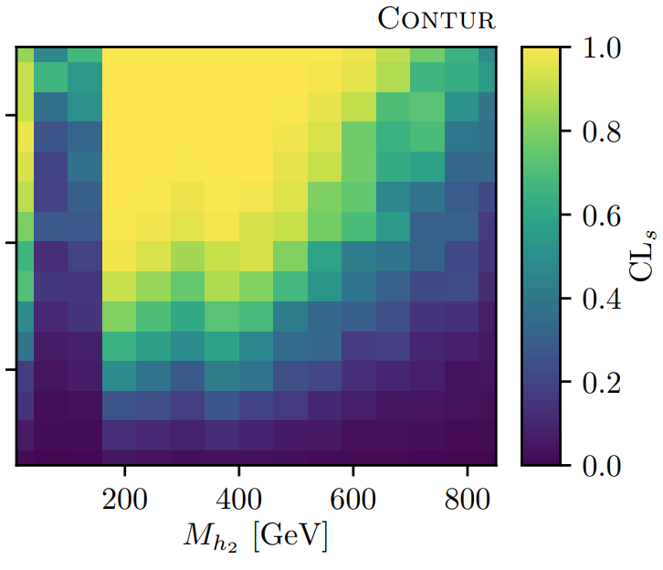

Formerly HEP @ UCL, PhD. with Prof. Butterworth
Viva by Prof. Potter [2019]

Formerly ATLAS collaboration, although more time spent on MCnet activities, Herwig and Rivet/Contur

Since 2021 PDRA in KICC, Cambridge. PI Dr Handley

----

<!-- paginate: true -->

### HEP related work

Technical developments:

__MultiNest__ [[0809.3437]](https://arxiv.org/abs/0809.3437)
__Polychord__ [[1506.00171]](https://arxiv.org/abs/1506.00171)

Analysis:

SuperBayes [[0809.3792]](https://arxiv.org/abs/0809.3792)
Gambit [[1705.07908]](https://arxiv.org/abs/1705.07908)
Various parameter scanning [[2101.04525]](https://arxiv.org/abs/2101.04525)
Phase Space Nested sampling [[2205.02030]](https://arxiv.org/abs/2205.02030)

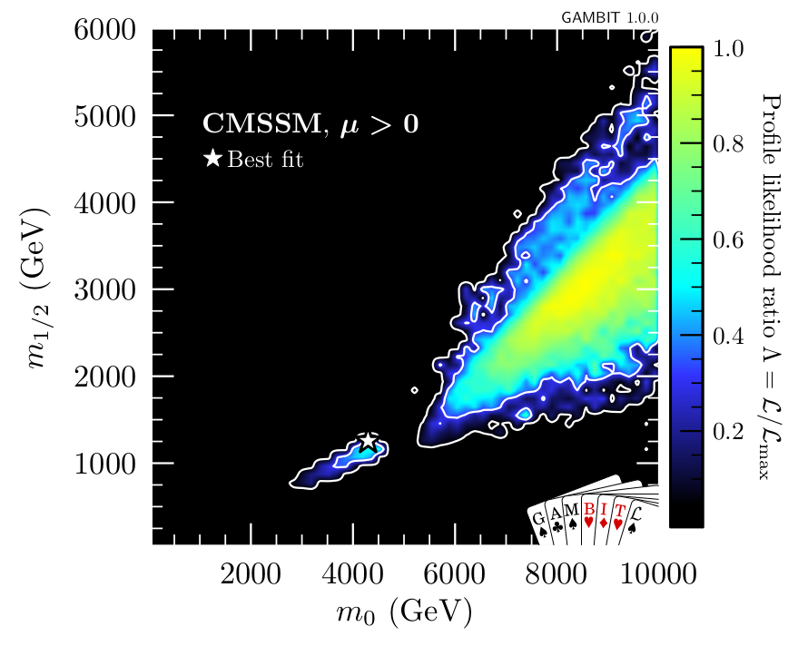

----

### The Rosetta Stone

Bumphunting [[2101.08320]](https://arxiv.org/abs/2101.08320)

Perhaps most poured over, developed, inference task in Particle

Today Presenting work by DY and Will Handley [[2211.10391]](https://arxiv.org/abs/2211.10391):
___"Hunting for Bumps in the Margins"___

----

### Goals for today: Extract the signal from the noise

Physics goal:

* The signal __(higgs)__ from the noise __(background process)__

Personal goals:

* 1. The signal __(Why we use Nested Sampling so much in cosmology)__ from the noise __(Bayesian vs Frequentist debate)__

* 2. I made some neat animations I want to show off

----

<!-- _class: invert lead -->

# Bayesian Techniques
A brief look at their role in Particle Physics
An introduction to Nested Sampling

----

### Why be Bayesian in Particle Physics?

## __For__

* Prominence in adjacent fields

* Simplifying framework 

* Often more principled 

* Can ask new questions

<!-- 
What most people think of
$$P(\Phi ) \propto \mathcal{L}(\Phi) \Pi (\Phi) $$

Not strictly an integral problem -->

## __Against__

* Tried and found wanting

* Conceptual difficulties

* Computational challenges

* Forces you to ask different questions

----

<!-- ### Why Be Bayesian in Particle Physics: Call and response

* _You're just shuffling the deck_
  * __I will try and identify things we can uniquely assess__

* _We've tried it all before_
  * __I will try and argue for an _Evidence_ first approach__

* _All very well in theory, but in practice often unfeasible_
  * __I will try and argue that the caveats to frequentist techniques often amount to the Bayesian equivalent__

---- -->

## A historic debate

* [[1st PhyStat workshop, 2000]](https://cds.cern.ch/record/411537/files/CERN-2000-005.pdf)

  Talk of Peter Clifford (Mathematical statistician, PhD student of Neyman)

* _"Well, maybe I didn’t spell it out, but before I came here I assumed that all physicists were Bayesians. Physicists are interested in induction, they want to modify their beliefs about the true state of nature on the basis of the data that they’ve observed. When you are busy __integrating out parameters, in a sense, you keep slipping into a Bayesian mode of operating__"_

<!-- &nbsp;
A potential aside on 5$\sigma$ -->

<!-- _"If you’re in a situation with high prior sensitivity, where the data is really not telling you a whole lot, then that’s an important piece of information too"_ -->

* ### Is HEP exceptional (compared to Bayesian dominated fundamental physics fields e.g. Cosmology?) Or have we missed a trick?

----
## A historic debate $-$ Hypothesis testing

A lot of ink spilled about this topic, my 2c,

* __Particle:__ Comparing $H_\mathrm{SM}$ to $H_\mathrm{SM+BSM}$ - strong prior beliefs overpower likelihoods
  * $\rightarrow$ Bayesian belief quantification perhaps not best suited

* __Cosmo:__ "Standard Model" $\Lambda_\mathrm{CDM}$ is an effective theory
  * $\rightarrow$ More analogous to SMEFT

*  In particle we are increasingly asking model comparison questions that move us towards the Cosmo side, see SMEFIT [[2105.00006]](https://arxiv.org/abs/2105.00006)

----
### Defining the evidence

* $$ \mathrm{Posterior} = \frac{\mathrm{Likelihood}\times \mathrm{Prior}}{\mathrm{Evidence}}\, $$

  $$ P(\theta | X) = \frac{\mathcal{L}(X | \theta)\times \Pi(\theta) }{Z}\, $$

  Where $Z = \int d\theta \mathcal{L}(X | \theta) \Pi(\theta)$

* Will sometimes see this as

  $$ P(\theta | X) = \frac{P(X | \theta)\times P(\theta) }{P(X)}\, $$

  definition of conditional probability

----

### Pillars of Bayesian inference

* ### Parameter Inference
  $$P(\Phi ) \propto \mathcal{L} \cdot \Pi (\Phi) $$

  What most people think of
  
  Not strictly an integral problem, ergodic time....

* ### __Model Comparison__

  $$\mathcal{Z} = \int d\Phi \mathcal{L}(\Phi) \Pi (\Phi) $$

  An "Evidence first" approach, concentrate on issues of model comparison

  Historically HARD

  

----
## Nested Sampling

Nested Sampling [[Skilling 2006]](https://projecteuclid.org/journals/bayesian-analysis/volume-1/issue-4/Nested-sampling-for-general-Bayesian-computation/10.1214/06-BA127.full), implemented for in PolyChord [[1506.00171]](https://arxiv.org/abs/1506.00171). Is a good way to generically approach this problem for $\mathcal{O}(10)\rightarrow \mathcal{O}(100)$ dimensions

__Features__
* Primarily an integral algorithm (largely unique vs other MCMC approaches)
* Designed for multimodal problems from inception 
* Requires construction that can sample under hard likelihood constraint
* Largely self tuning
  * $\rightarrow$ Little interal hyperparameterization
  * $\rightarrow$ More importantly, "tunes" any reasonable prior to posterior

----

### Himmelblau function

$$

f(x) \propto -\exp [(x^2 + y -11)^2 + \\ (x + y^2 -7)^2]

$$

Multimodal function, (exponential of square ~ Gaussian)

Four identical local minima

----

----

----

### Rastigrin function

$$

f(x) \propto - \sum [x_i^2 - 10 \cos(2\pi x_i)]

$$

An "optimally difficult" problem in 2D

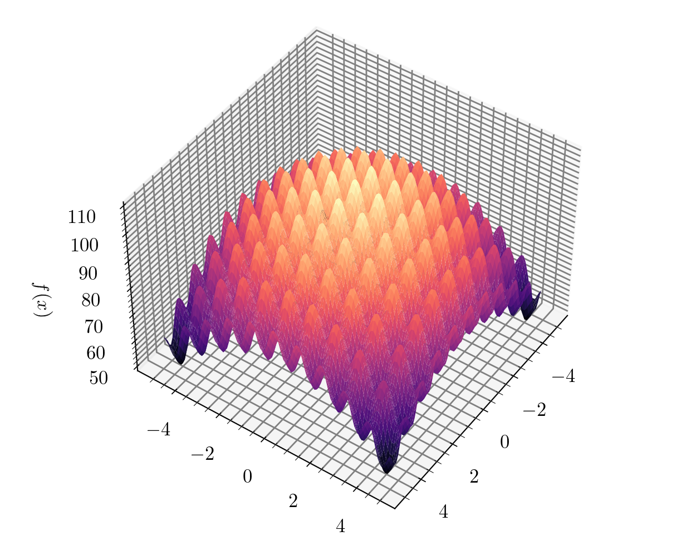

----

----

### Multimodality? Lattice field theory example

*"Flow-based sampling for multimodal distributions in lattice field theory"* [[2107.00734]](https://arxiv.org/abs/2107.00734)

$$
V(\phi) = \frac{\mu}{2} (\phi^\dagger\phi)^2 + \frac{\lambda}{4} (\phi^\dagger\phi)^4
$$

<!-- $\phi^4$ scalar lagrangian with wrong sign (higgs) mass potential -->

$\bar{\phi} = \langle \phi \phi \rangle$, magnetization (average value of field at all lattice sites)

HMC the workhorse for most lattice, but have to force these steps

  

----

<!-- _class: invert lead -->

# Diphotons and fitting in HEP

----
Discrete Profiling

Closest analogue [[1408.6865]](https://arxiv.org/abs/1408.6865)

ATLAS - Spurious signal tests

----

Discrete Profiling

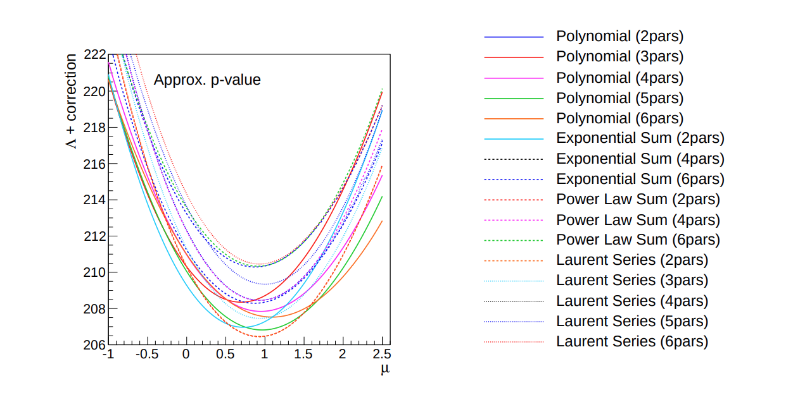

----
Discrete Marginal

$$
\footnotesize
    \phi= \mathrm{exp}:\\   b(x,\theta, N) = \sum_{m=1}^{N_{\mathrm{max}}} \theta_{1,m} \exp (-\theta_{2,m} x) \\
    \phi= \mathrm{power}: \\  b(x,\theta, N) = \sum_{m=1}^{N_{\mathrm{max}}} \theta_{1,m}  (x+1)^{-1.5\theta_{2,m}} \\
    \phi= \mathrm{logpoly}: \\  b(x,\theta, N) = \sum_{m=1}^{N_{\mathrm{max}}} \theta_{1,m} \log(x+e)^{-4\theta_{2,m}}

$$

----

Discrete Marginal

Frequentist: $\quad -\mathrm{AIC} = 2 \ln {\hat{\mathcal{L}}} - 2k$
Bayesian: $\quad \ln\mathcal{Z}  = \langle \ln \mathcal{L} \rangle_P - D_\mathrm{KL}$

----

Discrete Marginal

Frequentist: $\quad \mathcal{L}(N,\phi)_{\mathrm{AIC}}=\exp \bigg( \frac{\mathrm{AIC}_{\mathrm{min}}- \mathrm{AIC}_{N,\phi}}{2} \bigg)$
Bayesian: $\quad P(N,\phi)= \frac{\mathcal{Z}_{N,\phi}}{\sum(\mathcal{Z}_{N,\phi})}$

----
Discrete Marginal

Kullbeck-Leibler divergence:
__Information gain between prior and posterior__

$$
D_\mathrm{KL} = \int d\theta P(\theta) \ln \frac{P(\theta)}{\Pi(\theta)}
$$

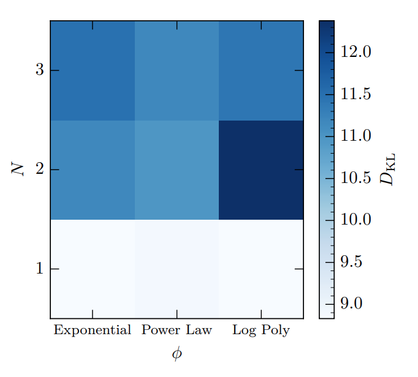

----

### Background only 

Fit to background only data

Generated unknown data from LO QCD diphoton production (from MCEG)

Sample realisation of Poission noise data

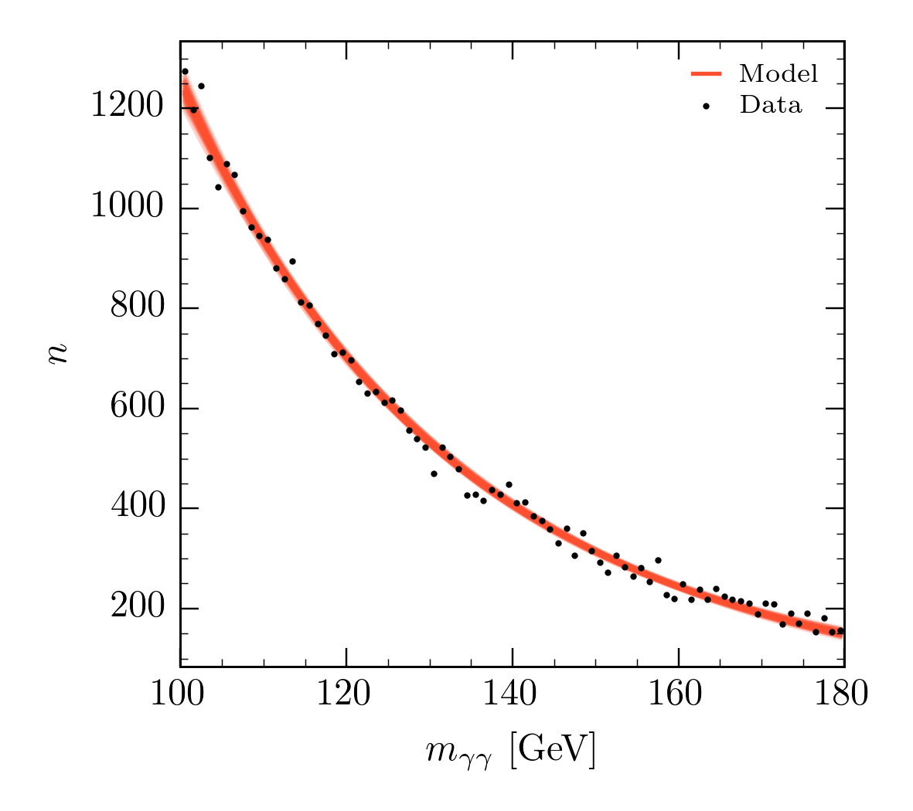

----

----

----

###

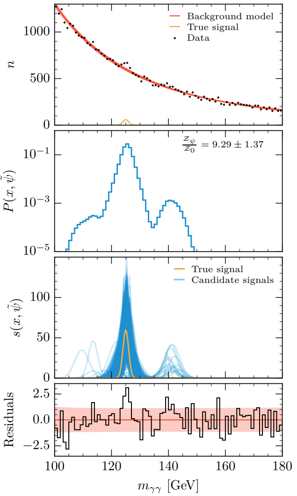

----

----

### SWIFT [[cds:2743717]](https://cds.cern.ch/record/2743717?ln=en)

Replace global parametric form with local "sliding window"

__Look Elsewhere Effect__ already a huge problem for this type of task (__more later__), this only exacerbates one of the main problems?

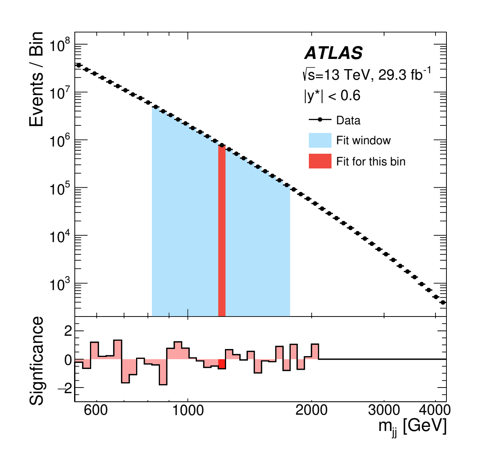

----

### Gaussian Process Regression [[cds:2743717]](https://cds.cern.ch/record/2743717?ln=en)

_"... The most interesting problems, the task of feature discovery for example, are __not__ ones that Gaussian processes will solve_"
__David Mackay - [[Inference]](http://www.inference.org.uk/mackay/itila/)__

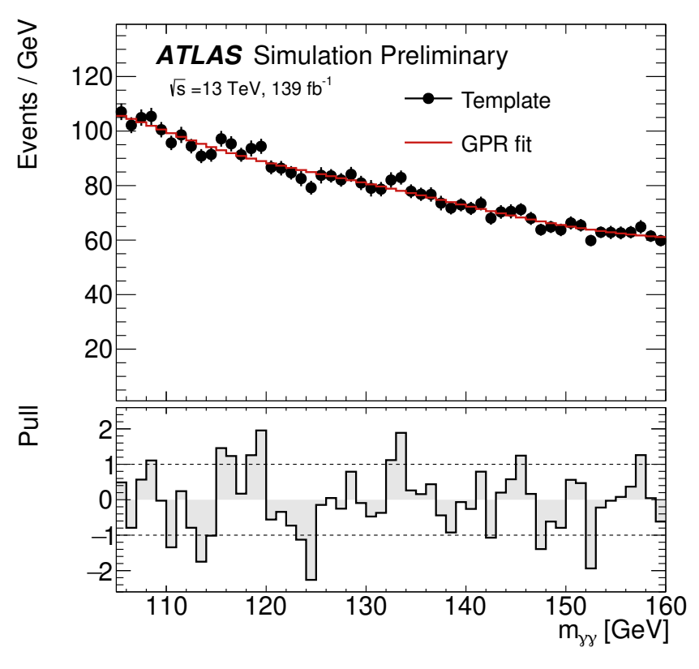

_"non-parametric models require the length scale over which the anomaly exhibits to be well separated from the length scale of the background
process"_
__[[2211.10391]](https://arxiv.org/abs/2211.10391)__

----

<!-- _class: invert lead -->

# Follow on from this work

Topics I'd like to think about more
Topics I'd be interested in hearing more about

----

### Look Elsewhere Effect

$$\frac{\mathcal{Z}_\psi}{\mathcal{Z}_0}= 9.29 \pm 1.37 $$ 

$\rightarrow$ roughly analogous to __global__ 90% confidence in $H_\psi$. Visually this seems low?!

_"significances from our Bayesian framework are typically about $1 – 2\sigma$ smaller than the global significances, ... This suggests that even global significances could significantly overstate the evidence against the background only model."_
[[1902.03243]](https://arxiv.org/abs/1902.03243)

Arbitrary nature of frequentist global p-value is worrying
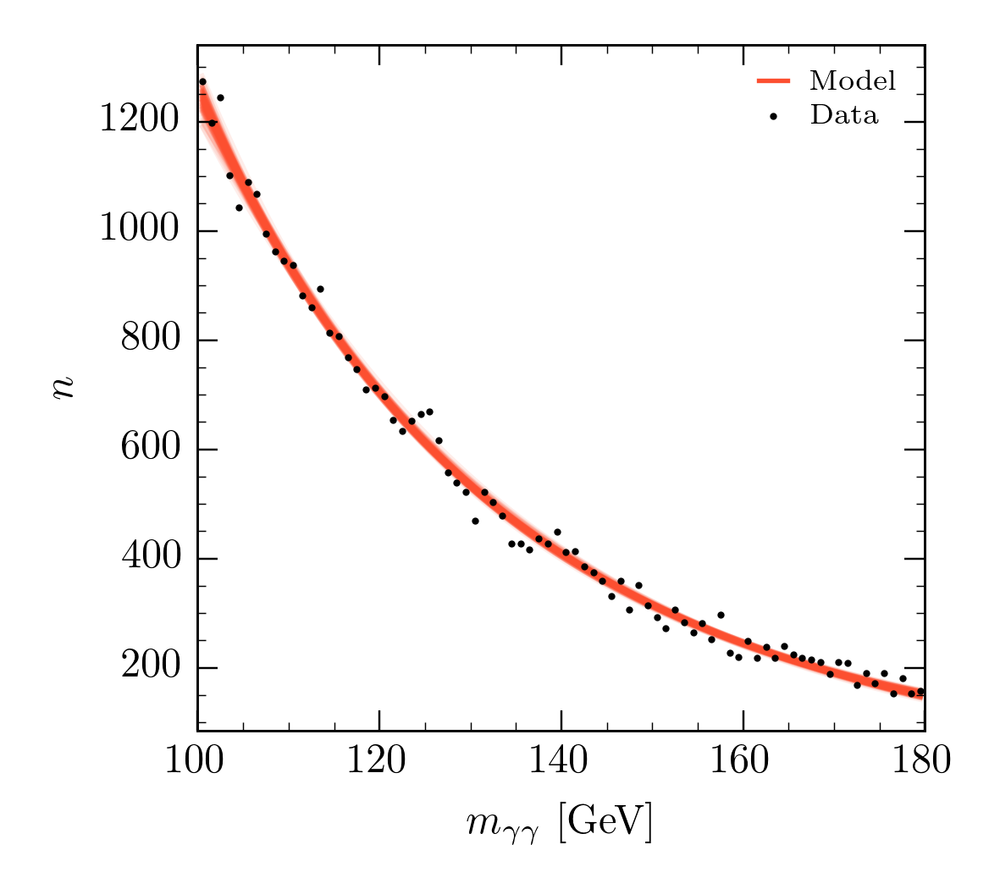

----

### Dijets and PDFs

Particularly sensitive to modelling in tails, e.g. dijet fit function

$$
f(x) = p_1 (1-x)^{p_2}x^{p_3+p_4\ln x}
$$

Small modelling differences can lead to large variance in parameters.

Less my area but PDFs really _feel_ like a Bayesian problem (lot's of $\chi^2$, Hessian approximations etc.)

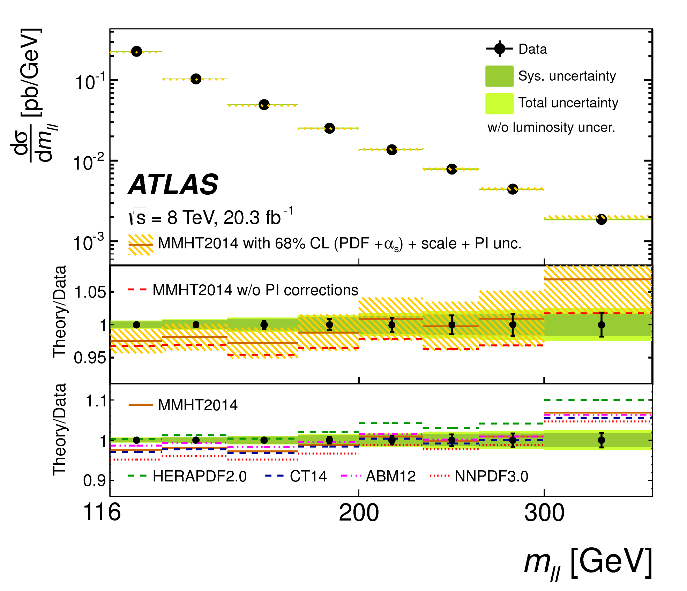

----
### Soft models

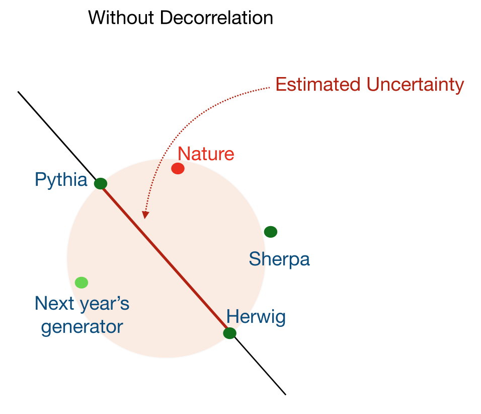

Tuning soft models already noted to be $\sim$ both BSM searches [[professor]](https://professor.hepforge.org/), already preliminarily posed as a Nested Sampling problem

Herwig (Cluster ~10 params) vs Pythia (String ~30 params) an excellent candidate for model comparison with strong dimensional difference

__There is an answer to age old 2 point comparisons in HEP__

----

----

#### Workhorse in HEP on this set of problems is Importance Sampling

$$ \mathrm{Posterior} = \frac{\mathrm{Likelihood}\times \mathrm{Prior}}{\mathrm{Evidence}}\, $$

- Replace problem of sampling from unknown $P(\Phi)$ with a known $Q(\Phi)$
- Adjust importance of sample drawn from $Q$ by weighting, $w=\frac{P(\Phi)}{Q(\Phi)}$

----

#### Problem seemingly reduces to coming up with good mappings for target
&nbsp;

However, Even in $D=\mathcal{O}(10)$ Dimensions this starts to break. 
- Massless glue scattering, $D=3n_g-4$:
  - $gg\rightarrow 3g$, $D=5$
  - $gg\rightarrow 4g$, $D=8$

Even modern ML (normalising flows) won't save you [[2001.05478]](https://arxiv.org/abs/2001.05478)

Algorithm | Efficiency $gg\rightarrow 3g$ | Efficiency $gg\rightarrow 4g$ 
-----|:-----:|:-----:
HAAG | 3.0% | 2.7% 
Vegas | 27.7% | 31.8% 
Neural Network | 64.3% | 33.6% 

----

## A sampling problem? Anyone for MCMC?

Central problem:
- Convergent integral means you have good posterior samples
- __Reverse not true__, Samples from a convergent MCMC chain __not__ guaranteed a good integral
- Multimodal targets well established failure mode.
  - Multichannel decompositions in MCMC HEP, (MC)$^3$ [[1404.4328]](https://arxiv.org/abs/1404.4328)

$$P(\Phi ) = \frac{ \mathcal{L}(\Phi) \Pi (\Phi)}{\mathcal{Z}} \propto \mathcal{L}(\Phi) \Pi (\Phi) $$
&nbsp;

_MCMC kicks in as we go to high dimensions, grey area between IS and MCMC, can ML help?_

----
# Gaussian Processes

_Have we thrown the baby out with the bath water?_

The success of Gaussian processes shows that many real-world data modelling problems are perfectly well solved by sensible smoothing methods. The most  interesting problems, the task of feature discovery for example, are __not__ ones that Gaussian processes will solve.

_Mackay Inference_ 

----

## Where's the Evidence?

In neglecting the Evidence ($\mathcal{Z}$) we have neglected precisely the quantity we want,

$$ \sigma = \int\limits_\Omega d\Phi |\mathcal{M}|^2 (\Phi)\, $$
$$ \mathcal{Z} = \int d\theta \mathcal{L} (\theta) \Pi (\theta)\, $$

- Mapping $\rightarrow$ Prior
- Matrix element $\rightarrow$ Likelihood
- Cross section $\rightarrow$ Evidence

----
## Pillars of Bayesian inference

## Parameter Inference

What most people think of
$$P(\Phi ) \propto \mathcal{L}(\Phi) \Pi (\Phi) $$

Not strictly an integral problem

## __Model Comparison__

An "Evidence first" approach, concentrate on issues of model comparison

* Historically HARD

$$\mathcal{Z} = \int d\Phi \mathcal{L}(\Phi) \Pi (\Phi) $$

----
## Nested Sampling

Nested Sampling [[Skilling 2006]](https://projecteuclid.org/journals/bayesian-analysis/volume-1/issue-4/Nested-sampling-for-general-Bayesian-computation/10.1214/06-BA127.full), implemented for in PolyChord [[1506.00171]](https://arxiv.org/abs/1506.00171). Is a good way to generically approach this problem for $\mathcal{O}(10)\rightarrow \mathcal{O}(100)$ dimensions

- Primarily an integral algorithm (largely unique vs other MCMC approaches)

- Designed for multimodal problems from inception 

- Requires construction that can sample under hard likelihood constraint

- Largely self tuning

  - Little interal hyperparameterization
  - More importantly, tunes any reasonable prior to posterior

----
# Takeaways

Integrals are useful

Gradients maybe aren't _all_ you need

----
<!-- _class:  lead -->

[[yallup.github.io/bayeshep_durham]](https://yallup.github.io/bayeshep_durham/) for animated versions

----

<!-- _class: lead -->

rastrigin

----
<!-- _class: invert lead-->

----
<!-- _class: invert lead-->

----
<!-- _class: invert lead-->

Unweighted Events 

----
<!-- _class: invert lead-->

Algorithm |  $gg\rightarrow 3g$ |  $gg\rightarrow 4g$  |  $gg\rightarrow 5g$
-----|:-----:|:-----: |:-----:
HAAG | 3.0% | 2.7% | 2.8%
Vegas (cold start) | 2.0% | 0.05% | 0.01% 
NS | 1.0% | 1.0% | 1.0%  

----

## Where do we go from here?

End to end stylised version of the problem demonstrated. 

This is deeper than coming up with a new way of mapping phase space

----

## Where do we go from here? 
(dedicated section in paper)

- _Physics challenges_

- Variants of NS algorithm

- Prior information

- Fitting this together with modern ML

----

## Physics challenges

The fundamental motivation for this work came from recognising not just an ML challenge but a physics challenge [[2004.13687]](https://arxiv.org/abs/2004.13687)

LO dijet isn't hard, NNNLO is. If your method isn't robust in these limits it doesn't solve the right problem. Unique features of NS open up interesting physics:

- __No mapping required:__ NLO proposals generically harder, NNLO more so 
- __No channel decomposition:__ can we be _really_ clever when it comes to counter events, negative events etc. with this?
- __Computation scaling guaranteed__ to $\sim$ polynomial with $D$, other methods exponential: We can do _genuinely_ high dimensional problems, $gg\rightarrow 10g$ anyone?

----
## Conclusion

In my opinion (your milage may vary)
<!-- Event generation is a Markov Chain sampling process (despite what you may have been told), needing stochastic refinement is inevitable. -->

<!-- Event Generation is fundamentally an inversion of a Conditional probability, Bayesian inference (and hence Markov Chains) are the (IMO) proper language for this problem -->

- The fundamental problem for LHC event generation trying to do Importance Sampling in high dimension.

- Machine learning can and will be useful, but this is not __just__ a machine learning mapping problem. 

- This __is__ a Bayesian inference problem, precisely calculating Evidences or Posterior sampling. 

- Nested Sampling is a high dimensional integration method, primarily from Bayesian Inference, that is an excellent choice for particle physics integrals

